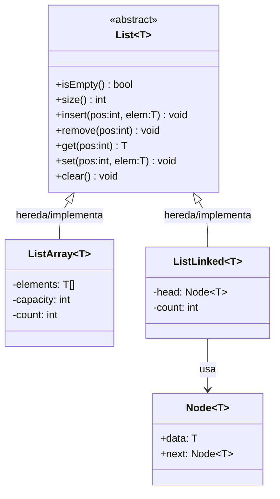

# Parte 1: EDL Lista genérica

En esta primera parte de la práctica diseñaremos una **interfaz genérica para una estructura de datos lineal de tipo lista**, y realizaremos **dos implementaciones de la misma**, basadas en las dos aproximaciones que conocemos de la asignatura "Programación" del semestre 1B de GIIR: **representación de secuencias en memoria contigua** (arrays) y **dispersa** (nodos enlazados).

Estas implementaciones de la EDL lista seran usadas por la clase [Drawing](../parte-2-jerarquia-de-dibujo-2d/clase-drawing.md) para gestionar un conjunto de figuras 2D que deben ser mostradas en una aplicación de dibujo.

Más concretamente, generaremos 4 clases:

* **`List<T>`**: Clase abstracta pura y genérica, que definirá los métodos de la interfaz de una EDL de tipo lista, para almacenar secuencias de objetos de tipo genérico `T`.
* **`ListArray<T>`**: clase genérica, derivada de `List<T>`, que implementará la interfaz siguiendo la aproximación de representación de secuencias en memoria contigua (arrays).&#x20;
* **`ListLinked<T>`**: clase genérica, derivada de `List<T>`, que implementará la interfaz siguiendo la aproximación de representación de secuencias en memoria dispersa (nodos enlazados).
* **`Node<T>`**: clase concreta que representa un nodo de una secuencia de nodos enlazados, cuyos elementos almacenados son de tipo genérico `T`.

