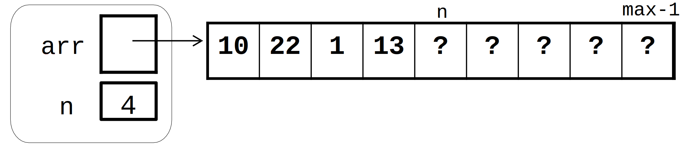

# Clase ListArray\<T>

### Descripción de la clase <a href="#descripcion-de-la-clase" id="descripcion-de-la-clase"></a>

Una vez definida la clase abstracta pura `List<T>`, vamos a crear la primera clase concreta que implementa los métodos de dicha la interfaz. Esta será `ListArray<T>`, una **clase derivada de `List<T>`**, que implementará la estructura de datos lista mediante una **representación de secuencias en memoria contigua** (con arrays).


Recuerda que en este tipo de representación, **los elementos de la lista SIEMPRE deben almacenarse de forma contigua en un array, empezando desde la posición `0` hasta la posición `size()-1`**.&#x20;

Por ejemplo, si una Lista contiene, eventualmente, 8 elementos, estos deben almacenarse, obligatoriamente, en cualquier circunstancia, entre las posiciones 0 y 7 del array.&#x20;

Esto implica que los métodos `insert()` y `remove()` de la interfaz deben realizar "tareas de mantenimiento" muy específicas para garantizar la contigüidad de los elementos en el array.


#### Atributos <a href="#atributos" id="atributos"></a>

| Visibilidad | Declaración                | Descripción                                                                                                                                          |
| ----------- | -------------------------- | ---------------------------------------------------------------------------------------------------------------------------------------------------- |
| `private`   | `T* arr`                   | Puntero al inicio del array que almacenará los elementos de la lista de forma contigua. Estos elementos son de tipo `T` genérico.                    |
| `private`   | `int max`                  | Tamaño actual del array (inicialmente igual a `MINSIZE`). Podrá alterarse durante la vida de la lista, en caso necesario (ver método `resize(int)`). |
| `private`   | `int n`                    | Número de elementos que contiene la lista.                                                                                                           |
| `private`   | `static const int MINSIZE` | Tamaño mínimo del array. Deberá inicializarse a 2.                                                                                                   |

<figure><figcaption><p>Representación gráfica de una lista implementada mediante una representación de secuencias basada en arrays</p></figcaption></figure>

### Métodos

**Además de implementar los métodos públicos heredados de la interfaz** [**`List<T>`**](interfaz-list-less-than-t-greater-than.md), deberá definir e implementar los siguientes métodos adicionales:

| Visibilidad | Método                                                                                                                                                           | Descripción                                                                                                                                                                                                                             |
| ----------- | ---------------------------------------------------------------------------------------------------------------------------------------------------------------- | --------------------------------------------------------------------------------------------------------------------------------------------------------------------------------------------------------------------------------------- |
| `public`    | `ListArray()`                                                                                                                                                    | Método constructor sin argumentos. Se encargará de reservar memoria dinámica para crear un array de `MINSIZE` elementos de tipo `T`, además de inicializar el resto de atributos de instancia.                                          |
| `public`    | `~ListArray()`                                                                                                                                                   | Método destructor. Se encargará de liberar la memoria dinámica reservada.                                                                                                                                                               |
| `public`    | `T operator[](int pos)`                                                                                                                                          | Sobrecarga del operador `[]`. Devuelve el elemento situado en la posición **`pos`**. Lanza una excepción **`std::out_of_range`** si la posición no es válida (fuera del intervalo `[0, size()-1]`).                                     |
| `public`    | <p><code>friend std::ostream&#x26; operator&#x3C;&#x3C;(</code></p><p><code>std::ostream &#x26;out,</code> </p><p><code>ListArray&#x3C;T> &#x26;list)</code></p> | Sobrecarga global del operador `<<` para imprimir una instancia de `ListArray<T>` por pantalla.                                                                                                                                         |
| `private`   | `void resize(int new_size)`                                                                                                                                      | Método privado que se encargará de redimensionar el array al tamaño especificado, con el objetivo de incrementar su capacidad (si está lleno), o bien para reducirla (si está "demasiado vacío"). Ver nota más abajo para más detalles. |

**Detalles de implementación del método `resize(int)`:**

* Podrá ser invocado por los métodos públicos `insert()`, `append()` y `prepend()`, o bien por el método público `remove()`, cuando sea necesario (queda a tu critero).
* La estrategia de redimensionado será la siguiente:
  1. Crear un nuevo array dinámico de `new_size` elementos (con el operador **`new`**).
  2. Copiar el contenido del `arr` (el array actual) en el nuevo array.
  3. Liberar los recursos de memoria que ocupa `arr` (con el operador **`delete[]`**)
  4. Actualizar el puntero `arr` para que apunte a la dirección de memoria en la que se encuentra el nuevo array.
  5. Actualizar `max`.


Ya que llamamos a `resize()`, siendo una operación relativamente costosa (coste lineal + tiempo de gestión de memoria), aprovecha para crear un nuevo array con una **capacidad significativamente mayor/menor**, según sea el caso.


***

## Actividad 3: Declaración e implementación de la clase ListArray\<T>


**La definición e implementación de clases genéricas/templatizadas se debe realizar en un único fichero de cabeceras (.h)**, para que el compilador pueda generar código específico derivado de los templates (más info [aquí](https://isocpp.org/wiki/faq/templates#templates-defn-vs-decl)).


Desde nuestro directorio de trabajo (raíz del repositorio git), abre Vim para crear el fichero `ListArray.h` que contendrá tanto la definición como la implementación de la clase `ListArray<T>`.

```bash
vim ListArray.h
```

Escribe en él la declaración de la clase genérica `ListArray<T>`, de acuerdo con la especificación del apartado anterior. A continuación tienes una "inicialización" o plantilla de dicho fichero, por si te sirve de ayuda para empezar:

<details>

<summary>Plantilla del fichero ListArray.h</summary>

```cpp
#include <ostream>
#include <stdexcept>
#include "List.h"

template <typename T> 
class ListArray : public List<T> {

    private:
        // miembros privados

    public:
        // miembros públicos, incluidos los heredados de List<T>
    
};
```

</details>


No olvides redefinir los métodos heredados de la interfaz `List<T>`, así como usar el calificador `override`, siguiendo las buenas prácticas de programación.&#x20;


Guarda el fichero (modo comando -> `:w`) y, sin salir de vim, ejecuta el compilador g++ para depurar tu implementación:

```bash
:!g++ -c ListArray.h  # Recuerda ejecutarlo desde el modo comando de vim!
```

Comprueba la salida del compilador. En casos de existir errores (seria lo más normal), examínalos con calma y detenimiento, y pulsa `ENTER` para volver al buffer de Vim para empezar a corregirlos. Repite este proceso, tantas veces como sea necesario, hasta que hayas depurado tu solución.&#x20;


Ten en cuenta que, al compilar un fichero `.h`, generará un fichero `.h.gch` (`ListArray.h.gch`) en lugar del "típico" `ListArray.o`. Ese fichero lo podemos eliminar sin problemas, no lo necesitaremos.


A continuación, añade el fichero al área de preparación de git:

```bash
git add ListArray.h
```

y confirma los cambios con un mensaje informativo:

```bash
git commit -m "Añadida implementación de la clase ListArray"
```


En realidad, no es imprescindible esperar a que finalices la implementación de un fichero para añadirlo y confirmarlo a git. Puedes, por ejemplo, hacer un commit cada vez que completes la implementación de una función. Eso sí, en la medida de lo posible, procura hacer commit solo cuando el fichero o ficheros en cuestión no tengan errores o problemas de compilación conocidos.&#x20;

En general, debemos evitar confirmar versiones de ficheros con errores conocidos.&#x20;


***

## Actividad 4: Inicialización del fichero Makefile y depuración de la clase TestArray\<T>

Guarda en nuestro directorio de trabajo (`PRA_2425_P1`), el siguiente fichero de código fuente `testListArray.cpp`:




Fíjate que, al importar el fichero `ListArray.h` no solo se importa la definición (interfaz) de la clase, sino también su implementación. Esto resulta imprescindible en clases templatizadas, ya que el compilador necesita conocer tanto la implementación de la plantilla como los tipos concretos (`int`, `double`, `string`, etc.) que "rellenarán" dicha plantilla, a fin de generar el código específico a ser ejecutado.


A continuación, procederemos a inicializar el fichero `Makefile` para automatizar el proceso de compilación del proyecto. Lo iremos actualizando y ampliando poco a poco, conforme lo vayamos necesitando. En esta primera fase, implementaremos dos reglas:

* Una regla para generar el objetivo `bin/testListArray` (binario ejecutable). Este dependerá de tres ficheros: `List.h`, `ListArray.h`, y `testListArray.cpp`. &#x20;
* Una regla `clean` que elimine todos los archivos `.o` y `.gch` generados en el directorio, así como el subdirectorio `bin`.&#x20;


Para una mejor organización, los ficheros binarios ejecutables del proyecto se generaran en un subdirectorio denominado **`bin`**.


Estando en el directorio raíz del proyecto, abre vim para crear el fichero `Makefile`:

```bash
vim Makefile
```

y añade las dos reglas:

```makefile
bin/testListArray: testListArray.cpp ListArray.h List.h
        mkdir -p bin
        g++ -o bin/testListArray testListArray.cpp ListArray.h

clean:
        rm -r *.o *.gch bin
```


Recuerda: **debes usar tabulador** (tecla `TAB`) para indentar los comandos de la regla.


A continuación, ejecuta la regla `bin/testListArray`:

```bash
make bin/testListArray
```

Finalmente, ejecuta el programa de test, para comprobar que tu implementación es correcta. Estando en el directorio raíz del proyecto (`PRA_2425_P1`):

```bash
./bin/testListArray
```

Esto debería generar una salida parecida a esta:

<details>

<summary>Salida esperada del progama de test "testListArray"</summary>

```
List => []
size(): 0
empty(): true

List => [
  -5
  0
  5
  10
]
size(): 4
empty(): false

l.get(0) => -5; l[0] => -5
l.get(3) => 10; l[3] => 10

l.remove(3) => 10: 
l.remove(1) => 0: 
l.remove(0) => -5: 

List => [
  5
]
size(): 1
empty(): false

List => [
  33
  5
  14
]
size(): 3
empty(): false

l.search(14) => 2
l.search(55) => -1
l.insert(-1, 99) => std::out_of_range: Posición inválida!
l.insert(4, 99) => std::out_of_range: Posición inválida!
l.get(-1) => std::out_of_range: Posición inválida!
l.get(3) => std::out_of_range: Posición inválida!
l.remove(-1) => std::out_of_range: Posición inválida!
l.remove(3) => std::out_of_range: Posición inválida!
```

</details>

Si tu salida es diferente, revisa tu código.&#x20;


Si la ejecución del programa se queda "colgada", seguramente sea porque ha entrado en un bucle infinito. Pulsa `CTRL+C` para "matar" el proceso, y revisa los bucles de tu código.&#x20;


Añade `testListArray.cpp` y `Makefile` a git (y `ListArray.h` también, si has hecho cambios):

```bash
git add testListArray.cpp Makefile ListArray.h
```

y confirma los cambios con un mensaje informativo:

```bash
git commit -m "Añadido Makefile y código de test de la clase ListArray"
```

Este parece ser un buen momento para sincronizar tu repositorio local con tu repositorio remoto de GitHub, para enviarle todos los cambios (_commits_) realizados localmente:

```bash
git push
```


Tampoco es necesario estar ejecutando constantemente `git push`. Hazlo solo cuando quieras que tus cambios se envíen al repositorio remoto, por ejemplo:

* para que tu profesor pueda ver la última versión de tu código en GitHub para ayudarte a resolver un problema.
* para realizar un backup de tu repositorio local.
* para poder sincronizar el estado del proyecto en otro dispositivo en el que quieres continuar el desarrollo.

