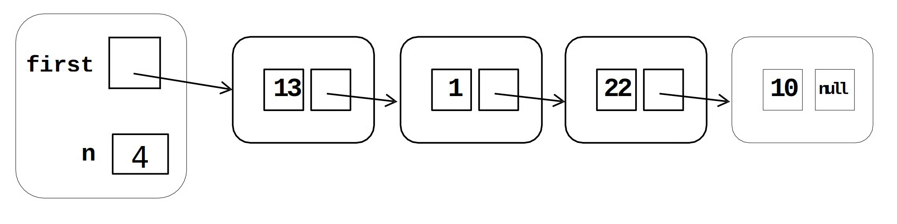

# Clase ListLinked\<T>

### Descripción de la clase <a href="#descripcion-de-la-clase" id="descripcion-de-la-clase"></a>

A continuación, vamos abordar una segunda implementación de la interfaz `List<T>`. En esta ocasión, se trata de `ListLinked<T>`, una **clase derivada de `List<T>`** que implementará la estructura de datos lista mediante una **representación de secuencias en memoria dispersa** (con nodos enlazados).

#### Atributos <a href="#atributos" id="atributos"></a>

| Visibilidad | Declaración      | Descripción                                                                                                |
| ----------- | ---------------- | ---------------------------------------------------------------------------------------------------------- |
| `private`   | `Node<T>* first` | Puntero al primer nodo de la secuencia enlazada que almacena los datos de la lista (de tipo `T` genérico). |
| `private`   | `int n`          | Número de elementos que contiene la lista.                                                                 |

<figure><figcaption><p>Representación gráfica de una lista implementada mediante una representación de secuencias basada en nodos enlazados</p></figcaption></figure>

### Métodos

**Además de implementar los métodos públicos heredados** de la interfaz `List<T>`, deberá definir e implementar los siguientes:

<table><thead><tr><th width="127">Visibilidad</th><th width="239">Método</th><th>Descripción</th></tr></thead><tbody><tr><td><code>public</code></td><td><code>ListLinked()</code></td><td>Método constructor sin argumentos. Inicializará los dos atributos de instancia (<code>first</code> será <code>nullptr</code>).</td></tr><tr><td><code>public</code></td><td><code>~ListLinked()</code></td><td>Método destructor. Se encargará de liberar la memoria dinámica reservada por los nodos <code>Node&#x3C;T></code> que componen la secuencia. Ver la nota de abajo para más detalles.</td></tr><tr><td><code>public</code></td><td><code>T operator[](int pos)</code></td><td>Sobrecarga del operador <code>[]</code>. Devuelve el elemento situado en la posición <strong><code>pos</code></strong>. Lanza una excepción <strong><code>std::out_of_range</code></strong> si la posición no es válida (fuera del intervalo <code>[0, size()-1]</code>).</td></tr><tr><td><code>public</code></td><td><p><code>friend std::ostream&#x26; operator&#x3C;&#x3C;(</code></p><p><code>std::ostream &#x26;out,</code> </p><p><code>ListLinked &#x26;list)</code></p></td><td>Sobrecarga global del operador <code>&#x3C;&#x3C;</code> para imprimir una instancia de <code>ListLinked&#x3C;T></code> por pantalla. Recuerda incluir la cabecera <code>&#x3C;ostream></code> en el <code>.h</code>.</td></tr></tbody></table>

#### Detalles de implementación del método destructor `~ListLinked()`

La estrategia a seguir será la siguiente:

1. Situar un puntero `aux` que apunte al nodo `first->next`.
2. Liberar la memoria ocupada por el nodo al que apunta `first`.&#x20;
3. Actualizar `first` para que apunte a la mismo nodo que `aux`.
4. Repetir los pasos 1-3 hasta que se alcance el final de la secuencia.

***

## Actividad 7: Declaración e implementación de la clase ListLinked\<T>


**La definición e implementación de clases genéricas/templatizadas se debe realizar en un único fichero de cabeceras (.h)**, para que el compilador pueda generar código específico derivado de los templates (más info [aquí](https://isocpp.org/wiki/faq/templates#templates-defn-vs-decl)).


Desde nuestro directorio de trabajo (raíz del repositorio git), abre Vim para crear el fichero `ListLinked.h` que contendrá tanto la definición como la implementación de la clase `ListLinked<T>`.

```bash
vim ListLinked.h
```

Escribe en él la declaración de la clase genérica `ListLinked<T>`, de acuerdo con la especificación del apartado anterior. A continuación tienes una "inicialización" o plantilla de dicho fichero, por si te sirve de ayuda para empezar:

<details>

<summary>Plantilla del fichero ListLinked.h</summary>

```cpp
#ifndef LIST_LINKED_H
#define LIST_LINKED_H

#include <ostream>
#include <stdexcept>
#include "List.h"
#include "Node.h"

template <typename T>
class ListLinked : public List<T> {

    private:
 
        // ...

    public:

        // ...
};

#endif LIST_LINKED_H
```

</details>

Guarda el fichero y, sin salir de vim, ejecuta el compilador g++ para depurar tu implementación:

```bash
:!g++ -c ListLinked.h  # Recuerda ejecutarlo desde el modo comando de vim!
```

Comprueba la salida del compilador. En casos de existir errores (seria lo más normal), examínalos con calma y detenimiento, y pulsa `ENTER` para volver al buffer de Vim para empezar a corregirlos. Repite este proceso, tantas veces como sea necesario, hasta que hayas depurado tu solución.&#x20;

A continuación, añade el fichero al área de preparación de git:

```bash
git add ListLinked.h
```

y confirma los cambios con un mensaje informativo:

```bash
git commit -m "Añadida implementación de la clase ListLinked"
```

***

## Actividad 8: Depuración de la clase ListLinked\<T>

Sitúate en nuestro directorio de trabajo, haz una copia del fichero `testListArray.cpp` , llamada `testListLinked.cpp`, y ábrela en vim:

```bash
cp testListArray.cpp testListLinked.cpp
vim testListLinked.cpp
```

Concretamente, vamos a cambiar la implementación de la interfaz `List<T>` que usará el programa de test:

* En lugar de importar `"ListArray.h"`, importará `"ListLinked.h"`.
* En lugar de crear una `ListArray<int>`, creará una `ListLinked<int>`.


Al compartir ambas clases la misma interfaz (declarada en la clase base `List<T>`), podemos **intercambiar las implementaciones de memoria contigua (`ListArray<T>`) y memoria dispersa (`ListLinked<T>`) de la EDL lista sin apenas esfuerzo**.


A continuación, abre vim para modificar el fichero `Makefile`:

```bash
vim Makefile
```

y añade la regla `bin/testListLinked`. Puedes inspirarte en la regla `bin/testLinkArray`.

A continuación, ejecuta la regla `bin/testListLinked`:

```bash
make bin/testListLinked
```

Ahora, ejecuta el programa de test, para comprobar que tu implementación es correcta. Estando en el directorio raíz del proyecto:

```bash
./bin/testListLinked
```

Esto debería generar la misma salida (o similar) que en [`testListArray`](clase-listarray-less-than-t-greater-than.md); esto es:

<details>

<summary>Salida esperada del progama de test "testListLinked"</summary>

```
List => []
size(): 0
empty(): true

List => [
  -5
  0
  5
  10
]
size(): 4
empty(): false

l.get(0) => -5; l[0] => -5
l.get(3) => 10; l[3] => 10

l.remove(3) => 10: 
l.remove(1) => 0: 
l.remove(0) => -5: 

List => [
  5
]
size(): 1
empty(): false

List => [
  33
  5
  14
]
size(): 3
empty(): false

l.search(14) => 2
l.search(55) => -1
l.insert(-1, 99) => std::out_of_range: Posición inválida!
l.insert(4, 99) => std::out_of_range: Posición inválida!
l.get(-1) => std::out_of_range: Posición inválida!
l.get(3) => std::out_of_range: Posición inválida!
l.remove(-1) => std::out_of_range: Posición inválida!
l.remove(3) => std::out_of_range: Posición inválida!
```

</details>

Si tu salida es diferente, revisa tu código. &#x20;

Añade `testListLinked.cpp` y `Makefile` a git (y `ListLinked.h` también, si has hecho cambios):

```bash
git add testListLinked.cpp Makefile ListLinked.h
```

y confirma los cambios con un mensaje informativo:

```bash
git commit -m "Añadido código de test de la clase ListLinked; Makefile actualizado"
```

Finalmente, sincroniza tu repositorio local con tu repositorio remoto de GitHub, para enviarle todos los cambios (_commits_) realizados localmente:

```bash
git push
```
