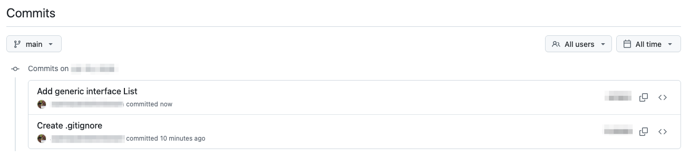

# Interfaz List\<T>

## Descripción de la interfaz

Vamos a describir los métodos que conformarán la interfaz genérica `List<T>`. Esta interfaz determinará de qué manera se puede gestionar una Lista de elementos de tipo `T` cualquiera. `List<T>` será una **clase abstracta pura y genérica** (templatizada), e incluirá los siguientes métodos **virtuales puros y genéricos**:

<table><thead><tr><th width="245.03515625">Método</th><th>Descripción</th></tr></thead><tbody><tr><td><code>void insert(int pos, T e)</code></td><td>Inserta el elemento <strong><code>e</code></strong> en la posición <strong><code>pos</code></strong>. Lanza una excepción <code>std::out_of_range</code> si la posición <code>pos</code> no es válida (fuera del intervalo <code>[0, size()]</code>).</td></tr><tr><td><code>void append(T e)</code></td><td>Inserta el elemento <strong><code>e</code></strong> al final de la lista.</td></tr><tr><td><code>void prepend(T e)</code></td><td>Inserta el elemento <strong><code>e</code></strong> al principio de la lista.</td></tr><tr><td><code>T remove(int pos)</code></td><td>Elimina y devuelve el elemento situado en la posición <strong><code>pos</code></strong>. Lanza una excepción <code>std::out_of_range</code> si la posición no es válida (fuera del intervalo <code>[0, size()-1]</code>).</td></tr><tr><td><code>T get(int pos)</code></td><td>Devuelve el elemento situado en la posición <strong><code>pos</code></strong>. Lanza una excepción <strong><code>std::out_of_range</code></strong> si la posición no es válida (fuera del intervalo <code>[0, size()-1]</code>).</td></tr><tr><td><code>int search(T e)</code></td><td>Devuelve la posición en la que se encuentra la primera ocurrencia del elemento <strong><code>e</code></strong>, o <code>-1</code> si no se encuentra.</td></tr><tr><td><code>bool empty()</code></td><td>Indica si la lista está vacía.</td></tr><tr><td><code>int size()</code></td><td>Devuelve el número de elementos de la lista.</td></tr><tr><td><code>~List()</code></td><td>Destructor virtual para activar polimorfismo: <code>virtual ~List() = default;</code></td></tr></tbody></table>


Trata de **reaprovechar al máximo el código** de estos métodos, **cuando sean implementados en las clases derivadas** [**ListArray\<T>**](clase-listarray-less-than-t-greater-than.md) **y** [**ListLinked\<T>**](clase-listlinked-less-than-t-greater-than.md). Por ejemplo, `append()` y `prepend()` son dos instancias particulares de `insert()`, ¿verdad?


***

## Actividad 2: Declaración de la interfaz List\<T>

Desde nuestro directorio de trabajo (raíz del repositorio git), abre vim para crear el fichero de cabeceras `List.h`:

```bash
vim List.h
```

Declara en él la clase abstracta pura `List`, de acuerdo con la especificación de la tabla del apartado anterior. &#x20;

Dado que esta clase va a ser importada desde múltiples fuentes, **debemos envolver la definición de la clase dentro de una guarda de importación** _("include guard")_, usando las directivas del preprocesador `ifndef <VAR>` _(if-not-defined)_ y `define <VAR>`. Esto nos evitará los errores de compilación correspondientes a una importación múltiple. Aquí tienes una plantilla:

```cpp
#ifndef LIST_H
#define LIST_H

template <typename T> 
class List {
    public:
        // ... aquí los métodos virtuales puros
};

#endif
```

Guarda el fichero y ejecuta `g++` en modo comprobación de sintaxis (opción `-fsyntax-only`) para asegurarnos que no hemos cometido ningún error en la declaración:

```bash
g++ -fsyntax-only List.h
```


Recuerda que puedes ejecutar este comando (y cualquier otro) sin salir de vim. Estando en modo comando, teclea **`:!`**&#x73;eguido del comando que desees ejecutar. En este caso:

```bash
:!g++ -fsyntax-only List.h
```


A continuación, añade el fichero al área de preparación de git:

```bash
git add List.h
```

y confirma los cambios con un mensaje informativo:

```bash
git commit -m "Add generic interface List"
```

&#x20;Si lo crees conveniente, haz `git push` para enviar los cambios a tu repositorio remoto en GitHub.&#x20;

<figure><figcaption></figcaption></figure>
