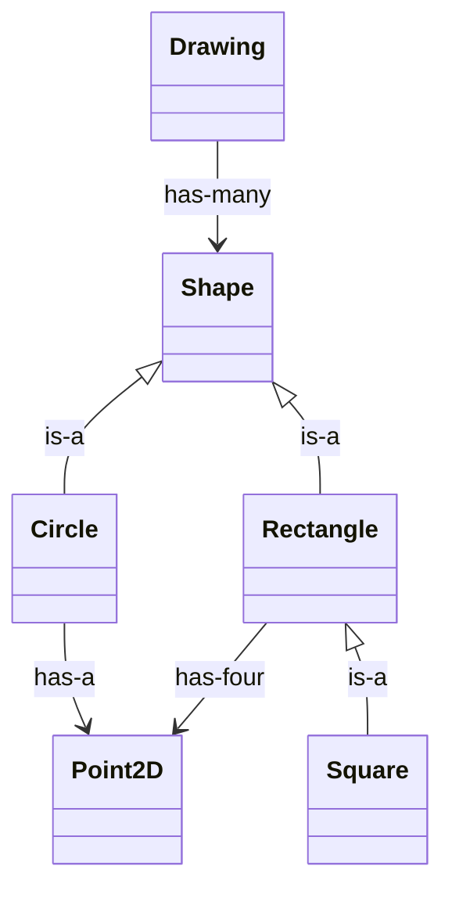

---
layout:
  width: wide
  title:
    visible: true
  description:
    visible: true
  tableOfContents:
    visible: true
  outline:
    visible: true
  pagination:
    visible: true
  metadata:
    visible: true
  tags:
    visible: true
  actions:
    visible: true
---

# Parte 2: Jerarquía de dibujo 2D

En esta segunda parte de la práctica diseñaremos e implementaremos una **jerarquía de clases que modele las entidades de una aplicación de dibujo 2D**. La aplicación gestionará un grupo de figuras mediante la estructura de datos `List<T>` que hemos diseñado e implementado en la [Parte 1](../parte-1-edl-lista-generica/). Se podrá optar por el uso de cualquiera de las dos implementaciones de dicha estructura de datos: mediante arrays (clase `ListArray<T>`) o mediante nodos enlazados (clase `ListLinked<T>`).&#x20;


Ambas implementaciones presentan diferencias sustanciales en lo que respecta al coste computacional de las diferentes operaciones de la interfaz (especialmente en `get()`) . ¿Serías capaz de determinarlas?


Concretamente, en esta segunda parte del proyecto, generaremos 6 clases:

* [**`Point2D`**](clase-point2d.md): representará un punto bidimensional del espacio cartesiano.
* [**`Shape`**](clase-abstracta-shape.md): clase abstracta, representa el concepto abstracto "figura" o "forma", y actuará de interfaz para definir el comportamiento de formas o figuras concretas.
* [**`Circle`**](clase-circle.md): clase derivada de `Shape`. Representa un círculo.
* [**`Rectangle`**](clase-rectangle.md): clase derivada de `Shape`. Representa un rectángulo.
* [**`Square`**](clase-square.md): clase derivada de `Rectangle`. Representa un cuadrado.&#x20;
* [**`Drawing`**](clase-drawing.md): se encargará de gestionar las figuras que conforman un dibujo 2D, a través de una [EDL lista](../parte-1-edl-lista-generica/).

