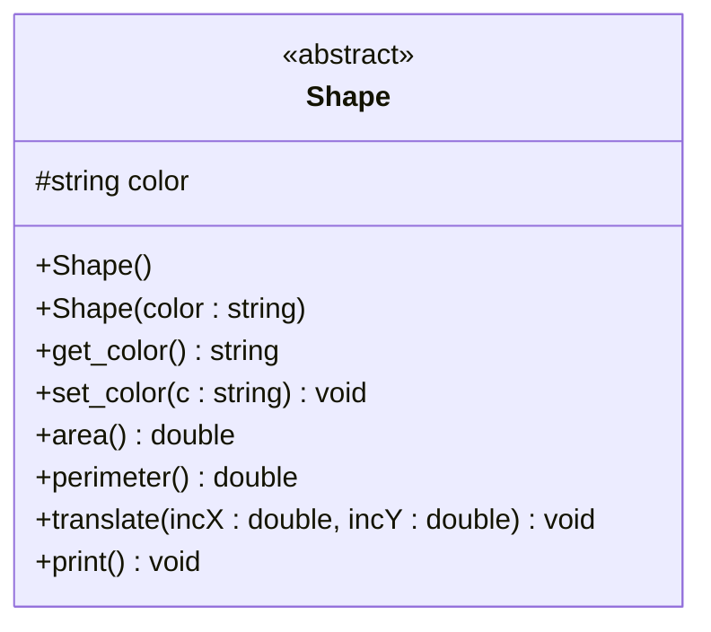

# Clase abstracta Shape

## Descripción de la interfaz

Vamos a describir los métodos que conformarán la interfaz  `Shape`. Esta interfaz determinará un conjunto de operaciones básicas que se pueden realizar sobre una forma o figura concreta. `Shape` será una **clase abstracta**, por lo que **no será instanciable** (aunque podrá ofrecer métodos constructores a sus clases derivadas).

<figure><figcaption></figcaption></figure>



### Atributos

<table><thead><tr><th width="129">Visibilidad</th><th width="193.671875">Declaración</th><th>Descripción</th></tr></thead><tbody><tr><td><code>protected</code></td><td><code>std::string color</code></td><td>Color de la figura. Solo podrá ser uno de estos tres valores: "red", "green", "blue".</td></tr></tbody></table>

### Métodos

La interfaz Shape ofrecerá los siguientes **métodos públicos**:

<table><thead><tr><th width="336.15234375">Perfil</th><th>Descripción</th></tr></thead><tbody><tr><td><code>Shape()</code></td><td>Constructor por defecto, crea una figura de color rojo. </td></tr><tr><td><code>Shape(std::string color)</code></td><td>Crea una figura del color especificado. Lanzará la excepción <strong><code>std::invalid_argument</code></strong> si el color proporcionado no es válido.</td></tr><tr><td><code>~Shape()</code></td><td>Activa polimorfismo en la destrucción: <code>virtual ~Shape() = default;</code></td></tr><tr><td><code>std::string get_color() const</code></td><td>Devuelve el color de relleno de la figura.</td></tr><tr><td><code>void set_color(std::string c)</code></td><td>Modifica el color de relleno de la figura. Solo podrá ser uno de estos tres valores: <code>"red"</code>, <code>"green"</code>, <code>"blue"</code>. Lanzará la excepción <strong><code>std::invalid_argument</code></strong> en caso de incumplir esta condición.</td></tr><tr><td><code>virtual double area() const</code></td><td>Método <strong>virtual </strong><mark style="color:red;"><strong>puro</strong></mark>. Calcula el área de una figura.</td></tr><tr><td><code>virtual double perimeter() const</code></td><td>Método <strong>virtual </strong><mark style="color:red;"><strong>puro</strong></mark>. Calcula el perímetro de una figura.</td></tr><tr><td><code>virtual void translate(double incX, double incY)</code></td><td>Método <strong>virtual </strong><mark style="color:red;"><strong>puro</strong></mark>. Traslada la figura sobre el espacio de representación, aplicando los incrementos de X e Y proporcionados.</td></tr><tr><td><code>virtual void print()</code></td><td>Método <strong>virtual </strong><mark style="color:red;"><strong>puro</strong></mark>. Imprimirá por pantalla información básica sobre la figura. </td></tr></tbody></table>


Se añade el método `print()` en sustitución de la sobrecarga del operador `<<` por motivos puramente didácticos, pues el método `operator<<()` no puede ser polimórfico, es decir, forzar su implementación en clases derivadas (al menos de forma directa).


***

## Actividad 11a: Declaración de la clase abstracta Shape&#x20;

Desde nuestro directorio de trabajo, crea con vim el fichero de cabeceras `Shape.h`. Dado que esta clase va a ser importada desde múltiples fuentes, **debemos envolver la definición de la clase dentro de una guarda de importación** _("include guard")_, usando las directivas del preprocesador `ifndef <VAR>` _(if-not-defined)_ y `define <VAR>`. Esto nos evitará los errores de compilación correspondientes a una importación múltiple. Aquí tienes una plantilla:

```cpp
#ifndef SHAPE_H
#define SHAPE_H

#include <string>
#include "Point2D.h"

class Shape {
    protected:
        // ...
    
    public:
        // ...
}

#endif
```

Comprueba que la sintaxis es correcta, y finalmente añade el fichero al repositorio git.


Dado que las clases herederas de `Shape` van a trabajar con la clase `Point2D`, es muy buena idea incluir aquí su fichero de cabecera (`#include "Point2D.h"`). Así, nos ahorramos el replicar dicha inclusión en cada una de las clases derivadas.


***

## Actividad 11b: Implementación de la clase Shape

Desde nuestro directorio de trabajo (`PRA_2627_P1`), crea con vim el fichero de código fuente `Shape.cpp`, para **implementar los métodos no virtuales**, de acuerdo con la especificación del fichero de cabeceras `Shape.h`.&#x20;


```cpp
#include "Shape.h"
#include <stdexcept>
#include <string>

Shape::Shape() : color("red") {

}

Shape::Shape(std::string color) {

}

std::string Shape::get_color() const {

}

void Shape::set_color(std::string c) {

}
```


Añade al fichero `Makefile` la regla de compilación pertinente (de manera similar a la regla `Point2D.o`). Corrige los errores de compilación, en caso necesario, y añade los cambios de ambos ficheros al repositorio git.&#x20;
