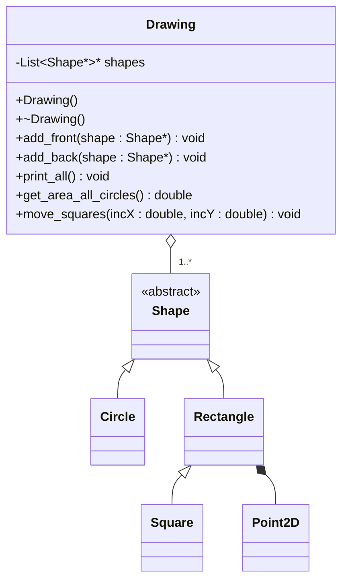

---
layout:
  width: wide
  title:
    visible: true
  description:
    visible: true
  tableOfContents:
    visible: true
  outline:
    visible: true
  pagination:
    visible: true
  metadata:
    visible: true
  tags:
    visible: true
  actions:
    visible: true
---

# Clase Drawing

## Descripción de la clase

La clase `Drawing` sera la encargada de modelar un dibujo de figuras 2D. Gestionará una lista de figuras, mediante la clase polimórfica y abstracta [`Shape`](clase-abstracta-shape.md) como interfaz para acceder a cualquiera de las clases derivadas. De forma similar, se usará la interfaz [`List<T>`](../parte-1-edl-lista-generica/interfaz-list-less-than-t-greater-than.md) para acceder a cualquiera de sus dos implementaciones [`ListArray<T>`](../parte-1-edl-lista-generica/clase-listarray-less-than-t-greater-than.md) o [`ListLinked<T>`](../parte-1-edl-lista-generica/clase-listlinked-less-than-t-greater-than.md).

El orden de los elementos de la lista determinará su precedencia en el dibujo, en caso de existir superposición de figuras: el primer elemento de la lista será el que aparecerá al frente, mientras que el último elemento aparecerá al fondo.



### Atributos

<table><thead><tr><th width="129">Visibilidad</th><th width="278">Declaración</th><th>Descripción</th></tr></thead><tbody><tr><td><code>private</code></td><td><code>List&#x3C;Shape*>* shapes</code></td><td>Lista de figuras representadas en el dibujo. </td></tr></tbody></table>


Notad que `shapes` es un **puntero** de tipo `List<Shape*>`, ya que `List<T>` es una clase abstracta y no se puede instanciar.&#x20;

La usaremos como interfaz a alguna de las dos clases derivadas, `ListArray<Shape*>` o `ListLinked<Shape*>`.&#x20;

En el constructor decidiremos cuál de las dos clases derivadas se instanciará (escoge la implementación que consideres más apropiada).  En cualquiera de los casos, el puntero de la clase base actuará como interfaz a la clase derivada.



Si no tienes una implementación funcional de `ListArray<T>` o de `ListLinked<T>`, entonces puedes salir (temporalmente) del paso optando por hacer uso del contenedor [std::vector\<T>](https://es.cppreference.com/w/cpp/container/vector) de la librería estándar de C++, cuya implementación debe ser muy similar a nuestro `ListArray<T>`.


### Métodos

La clase `Drawing` ofrece un conjunto reducido de métodos, ya que incorporar "todas" las funcionalidades de una aplicación de dibujo se aleja de nuestros objetivos. Las funcionalidades que se plantean aquí van dirigidas a trabajar los conceptos de programación avanzada que se han visto en el bloque 1 de teoría. Si te apetece, puedes añadir otros métodos (funcionalidades) que se te ocurran para manipular los elementos del dibujo.&#x20;

<table><thead><tr><th width="129">Visibilidad</th><th width="296.3671875">Perfil</th><th>Descripción</th></tr></thead><tbody><tr><td><code>public</code></td><td><code>Drawing()</code></td><td>Método constructor. Reserva memoria dinámica para el atributo <code>shapes</code>.</td></tr><tr><td><code>public</code></td><td><code>~Drawing()</code></td><td>Método destructor. Libera la memoria dinámica reservada por <code>shapes</code>.</td></tr><tr><td><code>public</code></td><td><code>void add_front(Shape* shape)</code></td><td>Añade la figura <code>shape</code> al frente del dibujo (al inicio de la lista).</td></tr><tr><td><code>public</code></td><td><code>void add_back(Shape* shape)</code></td><td>Añade la figura <code>shape</code> al fondo del dibujo (al final de la lista).</td></tr><tr><td><code>public</code></td><td><code>void print_all()</code></td><td>Muestra por pantalla información de todas las figuras del dibujo (no uses <code>&#x3C;iostream></code>, reaprovecha funcionalidad).</td></tr><tr><td><code>public</code></td><td><code>double get_area_all_circles()</code></td><td>Devuelve el área ocupada por todos los círculos presentes en el dibujo. Puedes usar un <code>dynamic_cast&#x3C;Circle*></code> para convertir un <code>Shape*</code> a <code>Circle*</code>.</td></tr><tr><td><code>public</code></td><td><code>move_squares(double incX, double incY)</code></td><td>Mueve todos los cuadrados del dibujo, aplicando los incrementos de X e Y proporcionados. De nuevo, puedes usar <code>dynamic_cast</code> para convertir un <code>Shape*</code> a un <code>Square*</code>.</td></tr></tbody></table>

***

## Actividad 18a: Declaración de la clase Drawing

Desde nuestro directorio de trabajo, crea con vim el fichero de cabeceras `Drawing.h`. Recuerda que debe declarar las funciones que se sobreescriben. Comprueba que la sintaxis es correcta, y finalmente añade el fichero al repositorio git.

***

## Actividad 18b: Definición de la clase Drawing

Desde nuestro directorio de trabajo, crea con vim el fichero de código fuente `Drawing.cpp`, de acuerdo con la especificación del fichero de cabeceras `Drawing.h`. Añade al fichero `Makefile` la regla de compilación pertinente. Corrige los errores de compilación, en caso necesario, y añade los cambios de ambos ficheros al repositorio git.&#x20;

***

## Actividad 19: Depuración de la clase Drawing

Guarda en nuestro directorio de trabajo (`PRA_2627_P1`), el siguiente fichero de código fuente `testDrawing.cpp`:



A continuación, añade una regla `bin/testDrawing` a tu `Makefile` para generar el binario ejecutable homónimo:&#x20;

```makefile
bin/testDrawing: testDrawing.cpp Drawing.o Square.o Rectangle.o Circle.o Shape.o Point2D.o
	g++ -c testDrawing.cpp
	mkdir -p bin
	g++ -o bin/testDrawing testDrawing.cpp Drawing.o Square.o Rectangle.o Circle.o Shape.o Point2D.o
```


Fíjate como este binario ejecutable depende del código objeto de todas las clases del proyecto. De hecho, `testDrawing.cpp` puede verse como una simulación del programa de dibujo.&#x20;


Finalmente, ejecuta el binario para comprobar que tu implementación es correcta:

```bash
./bin/testDrawing
```

Debería generar una salida como esta:

<details>

<summary>Salida esperada de la ejecución del binario "testDrawing"</summary>

```
Drawing contents:
[Square: color = red; v0 = (-1,1); v1 = (1,1); v2 = (1,-1); v3 = (-1,-1)]
[Circle: color = red; center = (0,0); radius = 1]
[Rectangle: color = red; v0 = (-1,0.5); v1 = (1,0.5); v2 = (1,-0.5); v3 = (-1,-0.5)]

Area (all circles) = 3.14159

Calling move_squares(10, 10)...
Drawing contents:
[Square: color = red; v0 = (9,11); v1 = (11,11); v2 = (11,9); v3 = (9,9)]
[Circle: color = red; center = (0,0); radius = 1]
[Rectangle: color = red; v0 = (-1,0.5); v1 = (1,0.5); v2 = (1,-0.5); v3 = (-1,-0.5)]

```

</details>

Si tu salida es diferente, revisa tu código.&#x20;

Finalmente, añade `testDrawing.cpp` y `Makefile` haz `git commit` y `git push`.
