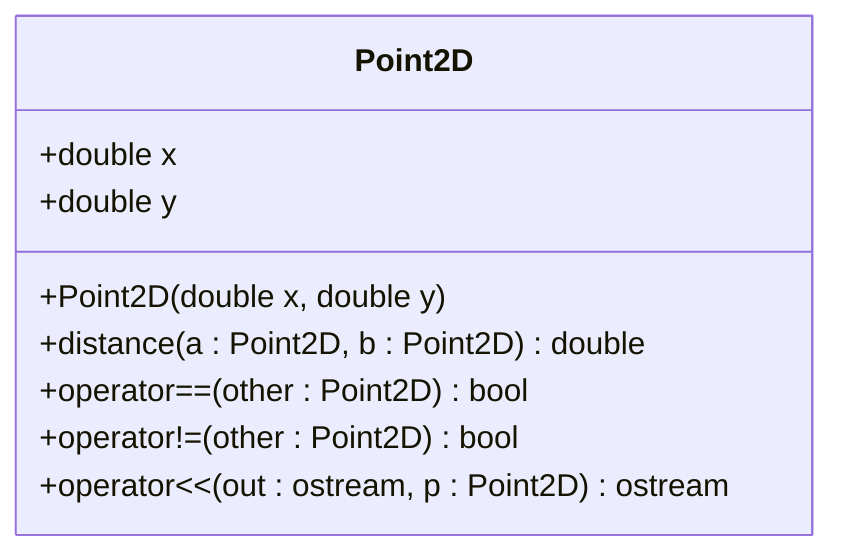

# Clase Point2D

### Descripción de la clase <a href="#descripcion-de-la-clase" id="descripcion-de-la-clase"></a>

El tipo de datos `Point2D`, que representa un punto bidimensional en el espacio cartesiano, estará definido por una clase concreta de igual nombre.



#### Atributos <a href="#atributos" id="atributos"></a>

<table><thead><tr><th>Visibilidad</th><th width="179.35546875">Declaración</th><th>Descripción</th></tr></thead><tbody><tr><td><code>public</code></td><td><code>double x</code></td><td>Coordenada x</td></tr><tr><td><code>public</code></td><td><code>double y</code></td><td>Coordenada y</td></tr></tbody></table>

#### Métodos <a href="#metodos" id="metodos"></a>

<table><thead><tr><th width="108.4765625">Visibilidad</th><th>Perfil</th><th>Descripción</th></tr></thead><tbody><tr><td><code>public</code></td><td><code>Point2D(double x=0.0, double y=0.0)</code></td><td>Método constructor. Por defecto, los ejes tomarán el valor 0.</td></tr><tr><td><code>public</code></td><td><code>static double distance(const Point2D &#x26;a, const Point2D &#x26;b)</code></td><td>Calcula la distancia euclidiana entre dos puntos <code>a</code> y <code>b</code>.</td></tr><tr><td><code>public</code></td><td><code>bool operator==(const Point2D &#x26;other)</code></td><td>Sobrecarga global del operador <code>==</code>. Comprueba si dos puntos son iguales.</td></tr><tr><td><code>public</code></td><td><code>bool operator!=(const Point2D &#x26;other)</code></td><td>Sobrecarga global del operador <code>!=</code>. Comprueba si dos puntos son diferentes.</td></tr><tr><td><code>public</code></td><td><p><code>friend std::ostream&#x26; operator&#x3C;&#x3C;(</code></p><p><code>std::ostream &#x26;out,</code> </p><p><code>const Point2D &#x26;p)</code></p></td><td>Sobrecarga global del operador <code>&#x3C;&#x3C;</code>. Recuerda incluir la cabecera <code>&#x3C;ostream></code> en el <code>.h</code>.</td></tr></tbody></table>


La distancia euclidiana $$d$$ entre dos puntos bidimensionales $$a=(a_1,a_2)$$ y $$b = (b_1, b_2)$$ se calcula como sigue: $$d(a,b)=\sqrt{(a_1-b_1)^2+(a_2-b_2)^2}$$.&#x20;

Usa las funciones [`sqrt()`](https://en.cppreference.com/w/cpp/numeric/math/sqrt) y [`pow()`](https://es.cppreference.com/w/cpp/numeric/math/pow)de la librería [`<cmath>`](https://en.cppreference.com/w/cpp/header/cmath).


***

## Actividad 9a: Declaración de la clase Point2D&#x20;

Desde nuestro directorio de trabajo (`PRA_2627_P1`), crea con vim el fichero de cabeceras `Point2D.h`.&#x20;

Dado que esta clase va a ser importada desde múltiples fuentes, **debemos envolver la definición de la clase dentro de una guarda de importación** _("include guard")_, usando las directivas del preprocesador `ifndef <VAR>` _(if-not-defined)_ y `define <VAR>`. Esto nos evitará los errores de compilación correspondientes a una importación múltiple:

```cpp
#ifndef POINT2D_H
#define POINT2D_H

#include <ostream>

class Point2D{
    // ... definición de la clase Point2D.h ...  
};

#endif
```

Finalmente, comprueba que la sintaxis es correcta (`g++ -fsyntax-only Point2D.h`), y finalmente añade el fichero al repositorio git:

```bash
git add Point2D.h
git commit -m 'Añadida declaración de la clase Point2D'
```

***

## Actividad 9b: Definición de la clase Point2D

Desde nuestro directorio de trabajo (`PRA_2627_P1`), crea con vim el fichero de código fuente `Point2D.cpp`, y define sus métodos de acuerdo con la especificación del fichero de cabeceras `Point2D.h`.&#x20;


```cpp
#include <ostream>
#include <cmath>
#include "Point2D.h"

double Point2D::distance(const Point2D &a, Point2D &b) {
    // A definir
}

bool Point2D::operator==(const Point2D &other) {
    // A definir
}

bool Point2D::operator!=(const Point2D &other) {
    // A definir
}

std::ostream& operator<<(std::ostream &out, const Point2D &p) {
    // A definir
}
```



En el .cpp no es necesario añadir a la firma de los métodos las palabras clave `static` ni `friend` en los métodos.


Añade al fichero `Makefile` la regla de compilación pertinente para generar su fichero `.o`:

```makefile
Point2D.o: Point2D.cpp Point2D.h
        g++ -c Point2D.cpp
```

A continuación, ejecuta la regla `testNode`:

```bash
make Point2D.o
```

Corrige los errores de compilación, en caso necesario, y añade los cambios de ambos ficheros al repositorio git:

```bash
git add Point2D.cpp Makefile
git commit -m 'Add Point2D class and update Makefile'
```

***

## Actividad 10: Depuración de la clase Point2D&#x20;

Desde nuestro directorio de trabajo (`PRA_2627_P1`), crea con vim el fichero de código fuente `testPoint2D.cpp`, con el siguiente contenido:

```cpp
#include <iostream>
#include "Point2D.h"
    
int main(){
    std::cout << std::boolalpha; // config. para mostrar true/false en lugar de 0/1.
    Point2D a(0,0);
    Point2D b(1,1);
    std::cout << "a = " << a << "; b = " << b << std::endl;
    std::cout << "d(a,b) = " << Point2D::distance(a, b) << std::endl; // 1.41421 
    std::cout << "a==b --> " << (a == b) << std::endl; // false
    std::cout << "a!=b --> " << (a != b) << std::endl; // true

    std::cout << std::endl;
    a = b;
    std::cout << "a = " << a << "; b = " << b << std::endl;
    std::cout << "d(a,b) = " << Point2D::distance(a, b) << std::endl; // 0
    std::cout << "a==b --> " << (a == b) << std::endl; // true
    std::cout << "a!=b --> " << (a != b) << std::endl; // false
}

```

A continuación, añade esta regla a tu `Makefile` para generar el binario ejecutable (se guardará en el directorio `bin`):

<pre class="language-makefile"><code class="lang-makefile"><strong>bin/testPoint2D: testPoint2D.cpp Point2D.o
</strong>        g++ -c testPoint2D.cpp
        mkdir -p bin
        g++ -o bin/testPoint2D testPoint2D.o Point2D.o
</code></pre>

Finalmente, ejecuta el binario para comprobar que tu implementación es correcta:

```bash
./bin/testPoint2D
```

Debería generar una salida como esta:

```
a = (0,0); b = (1,1)
d(a,b) = 1.41421
a==b --> false
a!=b --> true

a = (1,1); b = (1,1)
d(a,b) = 0
a==b --> true
a!=b --> false
```

Si la semántica de tu salida es diferente, revisa tu código.&#x20;

Finalmente, haz add y _commit_ de `testPoint2D.cpp` y `Makefile` con git.
