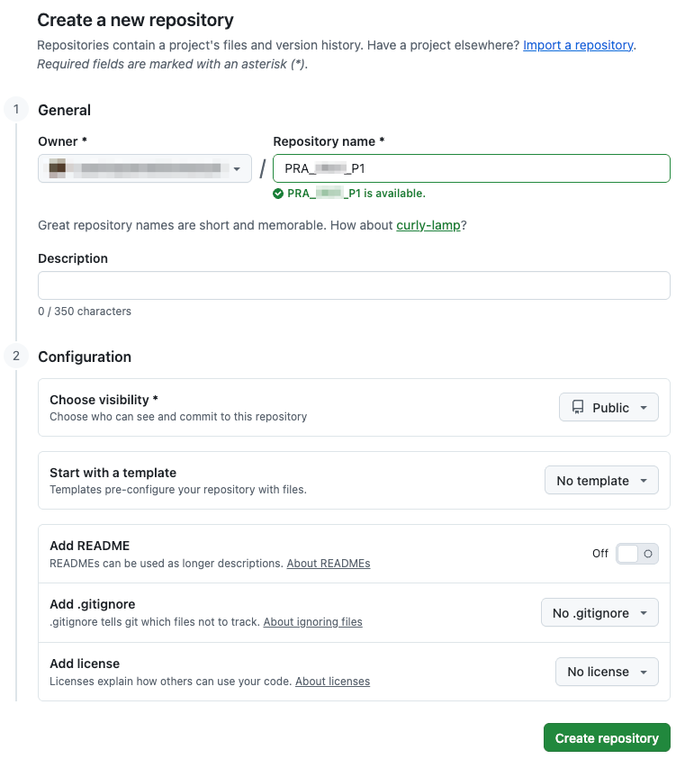

# Preparación del entorno

## Preparación del entorno

¿Has realizado la [Práctica 0](https://app.gitbook.com/o/X8vAd4LY1sPkw0QLbSUw/s/KCglCYAzIkqjjsArrX0I/)? Si la respuesta es negativa, hazla cuanto antes. Es un prerequisito fundamental para realizar satisfactoriamente esta práctica.&#x20;

Asegúrate que tienes instaladas las herramientas vim, g++, git y Make.

***

## Actividad 1a. Crea un repositorio remoto en GitHub <a href="#actividad-1a.-crea-un-repositorio-remoto-en-github" id="actividad-1a.-crea-un-repositorio-remoto-en-github"></a>

Entra a tu cuenta de GitHub y **crea un repositorio público, vacío** (sin inicializar), con el siguiente nombre: `PRA_2627_P1`.

<figure><figcaption></figcaption></figure>

Copia la URL que se muestra tras la confirmación.

***

## Actividad 1b. Clona el repositorio en tu equipo <a href="#actividad-1b.-clona-el-repositorio-en-tu-equipo" id="actividad-1b.-clona-el-repositorio-en-tu-equipo"></a>

Abre una terminal Bash de Linux, sitúate en el directorio (`cd`) donde quieras mantener organizados tus repositorios git de la asignatura (p.ej., `/home/TUUSUARIO/UPV/PRA/Lab`), y **clona el repositorio**:

```bash
git clone ${URL} # Reemplaza ${URL} por lo que corresponda.
```

Este comando clonará tu repositorio de GitHub en un directorio llamado `PRA_2627_P1`, que, como podrás comprobar, está vacío. Sitúate en ese directorio para "entrar" dentro de nuestro repositorio git local:

```bash
cd PRA_2627_P1
```

Este repositorio local está enlazado con el repositorio remoto de GitHub, por lo que los comandos `git pull` y `git push` interactuarán con él.

Tened en cuenta que `PRA_2627_P1` será nuestro directorio de trabajo durante toda la práctica. Es decir, todos los ficheros se guardaran en ese directorio, y todos los comandos se ejecutarán desde ese directorio.

***

### Actividad 1c. Añade el `.gitignore`

De manera similar a la práctica 0, añade el fichero .gitignore al repositorio local y súbelo a Github en un primer commit.
